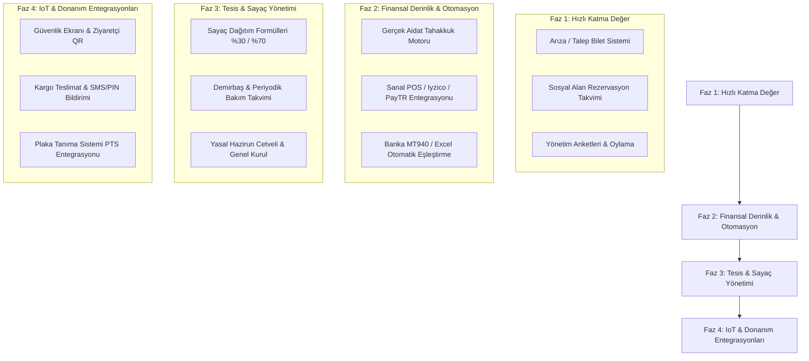

# 📊 Sitera vs. Apsiyon: Kapsamlı Ürün, Modül & Eksiklik Analizi

> **Rapor Tarihi:** Eylül 2026  
> **Proje:** Sitera Monorepo (Web, API, Mobil)  
> **Hedef:** Türkiye toplu yaşam yönetim pazar lideri **Apsiyon** ile Sitera arasındaki modüler farkları, henüz prototip seviyesinde dahi bulunmayan yetenekleri ve yol haritası önerilerini belirlemek.

---

## 📌 1. Yönetici Özeti (Executive Summary)

**Sitera**, kurumsal seviyede bir teknik temel üzerine inşa edilmiştir:
- **Teknoloji:** NestJS 10, TypeORM, PostgreSQL 16 (Row-Level Security / RLS ile veri izolasyonu), Redis 7 (önbellekleme ve oturum), React 19 (Vite), React Native (Expo) ve Turborepo monorepo mimarisi.
- **Mevcut Özellikler:** Süper Admin ve Yönetici paneli, çoklu site (Tenant/Grup) yönetimi, bağımsız bölüm (daire) ve sakin CRUD işlemleri, toplu daire üretici (Bulk Generator), Excel/CSV içe aktarma, sakin atama çekmecesi (Drawer).
- **Prototip/Taslak Seviyesinde Olanlar:** Aidat dönemleri, borç listesi, havale/ödeme onayları, icra takip, audit log ve bildirim kartları (UI üzerinde statik/mockup halinde).

**Apsiyon**, yalnızca bir aidat takip programı değil; **fiziksel donanımlarla konuşan (IoT)**, **enerji dağıtım mevzuatını işleten**, **yasal süreçleri (Genel Kurul, UYAP, İcra) yürüten** ve **bankalarla anlık veri akışı kuran 360 derece bir ekosistemdir.**

Aşağıdaki bölümlerde, Sitera'da **prototipi dahi bulunmayan** tüm modüller detaylandırılmıştır.

---

## 🔍 2. Sitera'da Prototipi Dahi Bulunmayan Modüller & Özellikler

### 1️⃣ Donanım, IoT & Fiziksel Güvenlik Entegrasyonları
Apsiyon'u klasik yönetim yazılımlarından ayıran en temel unsur, site kapısı ve güvenlik donanımlarıyla entegre olmasıdır:

* **Plaka Tanıma Sistemi (PTS) & Akıllı Bariyer:**
  * Kameralardan gelen RTSP akışları veya PTS yazılımları ile webhooks/API entegrasyonu.
  * Sakin araç plakaları sisteme kayıtlıysa bariyerin beklemesiz açılması.
  * Misafir araç süresi dolduğunda güvenliğe alarm düşmesi.
* **Akıllı Ziyaretçi & QR Geçiş Sistemi:**
  * Sakinin mobil uygulamadan misafiri için geçerlilik süreli (örn. 4 saatlik) tek kullanımlık QR kod üretmesi.
  * Güvenlik kulübesindeki tablet/okuyucuda QR taranarak temas olmadan hızlı giriş yapılması.
* **Kargo & Kurye Teslimat Yönetimi (veya Akıllı Kargo Dolabı):**
  * Güvenlik/danışma personeli gelen paketin kargo firmasını, takip no'sunu ve daire numarasını sisteme girer / barkod okutur.
  * Sakine anında mobil push bildirim ve SMS ile teslim alma PIN kodu gider.
  * Sakin teslim alırken PIN veya dijital imza ile teslim edilir; kayıp kargo tartışmaları biter.
* **Güvenlik Devriye / Tur Kontrol Entegrasyonu:**
  * Güvenlik görevlisinin gece devriyesinde sitenin kritik noktalarındaki NFC/RFID etiketleri akıllı telefonla okutarak turunu tamamlaması ve raporlanması.
* **İnterkom / Görüntülü Diafon & Kapı Açma:**
  * Sakin evde yokken zil çaldığında çağrının mobil uygulamaya düşmesi; blok kapısının cepten uzaktan açılabilmesi.

---

### 2️⃣ Sayaç Okuma, Isı Pay Ölçer & Enerji Dağıtım Motoru
Büyük sitelerin ve rezidansların Sitera'yı tercih edebilmesi için en zorunlu ihtiyaçtır:

* **Otomatik Sayaç Okuma (M-Bus / LoRaWAN / RF):**
  * Kalorimetre, sıcak su, soğuk su, elektrik sayaçlarının her ay daire daire gezilmeden radyo dalgalarıyla otomatik okunması.
* **5627 Sayılı Enerji Verimliliği Kanunu Uyumluluğu:**
  * Merkezi sistem ısıtma giderlerinin yasal formülle paylaştırılması: **%30 Ortak Kullanım (m² bazlı) + %70 Bağımsız Bölüm Fiili Tüketimi**.
* **Kaçak / Tesisat Arızası Tespiti:**
  * Dairede yaşayan yokken dönen su sayacı veya aşırı sarfiyat durumunda yöneticiye anlık su kaçağı uyarısı verilmesi.

---

### 3️⃣ Sosyal Tesis & Ortak Alan Rezervasyon Motoru
* **Sosyal Alan Rezervasyonu:**
  * Tenis kortu, futbol sahası, squash, açık/kapalı havuz, sauna, Türk hamamı, barbekü alanı, sinema odası, misafirhane ve toplantı salonu rezervasyonları.
* **Gelişmiş Kural Motoru:**
  * Daire başına haftalık/aylık maksimum kullanım kotası (örn. Tenis kortu haftada en fazla 2 saat).
  * Rezervasyon iptal süresi ve ceza mekanizması.
  * Ücretli alanlar için depozito veya saatlik ücretin sanal POS ile anında tahsil edilmesi.
  * Turnike/kapı yetkisi: Sadece rezervasyon saati gelen sakinin turnikeden geçebilmesi.

---

### 4️⃣ Teknik Arıza, İş Emri (Work Order) & Demirbaş Takibi
* **Fotoğraflı Arıza / Talep Bildirimi (Ticketing):**
  * Sakinin kırık lamba, asansör arızası veya bahçe bakımı talebini fotoğraf/video ekleyerek oluşturması.
* **İş Emri (Work Order) & Teknisyen/Taşeron Atama:**
  * Yönetimin talebi kadrolu teknisyene (elektrikçi, tesisatçı) veya dış taşeron firmaya iş emri olarak ataması.
  * Süreç takibi: *Yeni Talep ➔ İş Emri Verildi ➔ Malzeme Bekleniyor ➔ Tamamlandı ➔ Sakin Onayladı/Puanladı*.
* **Demirbaş Envanteri & Periyodik Bakım Takvimi:**
  * Asansörlerin yıllık A Tipi muayene ve **Yeşil Etiket** takip süreleri.
  * Yangın söndürme tüpleri basınç testi ve dolum tarihleri.
  * Jeneratör, hidrofor ve su deposu filtre/ilaçlama periyodik bakım alarmları.

---

### 5️⃣ Personel, Bordro & İK Yönetimi
* **Site Personeli Takibi:**
  * Kapıcı, güvenlik, bahçıvan, temizlik görevlilerinin vardiya planları, yıllık izin ve puantaj çizelgeleri.
* **Kapıcı Muafiyetli Bordrolama:**
  * Gelir Vergisi Kanunu 23/16 maddesi uyarınca kapıcı ücretlerindeki vergi muafiyeti hesaplamaları.
  * SGK e-Bildirge dökümleri ve kıdem tazminatı karşılık fonu hesabı.

---

### 6️⃣ Genel Kurul, Yasal Hazirun Cetveli & Dijital Karar Defteri
* **Yasal Hazirun Cetveli:**
  * Kat Mülkiyeti Kanunu'na (KMK) göre arsa payı oranları, bağımsız bölüm sayıları ve vekalet sınırlamaları (en fazla %5 veya 2 oy kuralı) doğrultusunda otomatik hazirun oluşturma.
* **Dijital Genel Kurul & E-Oylama:**
  * Fiziksel olarak toplantıya gelemeyen maliklerin uzaktan kimlik doğrulayarak canlı oylamaya katılması.
  * Karar yeter sayısı (nisap) otomatik hesaplama (salt çoğunluk, 4/5 veya oy birliği gerektiren kararlar).
* **Dijital Karar Defteri:**
  * Alınan kararların e-imza veya zaman damgasıyla sisteme işlenmesi, geçmişe dönük arşivi.

---

### 7️⃣ İleri Muhasebe, Banka MT940 & Yasal Hukuk/İcra
* **Banka MT940 Canlı Ekstre Entegrasyonu:**
  * Türkiye'deki tüm büyük bankalarla (Garanti, İş Bankası, Yapı Kredi, Akbank, Ziraat vb.) entegrasyon.
  * Bankadan gelen hesap hareketlerindeki açıklamada "Daire 12", "TCKN" veya ad-soyad tespit edilerek borcun insan eli değmeden kapatılması.
* **Sanal POS & Otomatik Ödeme Talimatı:**
  * Sakinin kredi kartını Masterpass/Param altyapısıyla kaydetmesi; her ay aidat tahakkuk ettiğinde otomatik çekilmesi.
* **Tek Düzen Hesap Planı & E-Fatura / E-Arşiv:**
  * Çift taraflı muhasebe kaydı (borç/alacak), mizan, bilanço, muavin defteri, işletme projesi hazırlama.
  * GİB e-Fatura entegratörleri üzerinden tedarikçi faturalarının otomatik içeri alınması.
* **UYAP İcra Takip Entegrasyonu:**
  * Geciken borçlara yasal **aylık %5 gecikme tazminatı** işletilmesi.
  * Otomatik noter ihtarnamesi taslağı.
  * Tek tıkla avukat için **UYAP uyumlu İcra Takip Dosyası (XML/UDF)** üretilmesi.
* **Satın Alma & Teklif Toplama (Procurement):**
  * Sitede yapılacak bir tadilat veya hizmet alımı için 3 farklı tedarikçiden teklif istenmesi, yönetim kurulunun onayına sunulması.

---

### 8️⃣ Komşuluk, Sosyal Yaşam, İlanlar & Pazaryeri
* **Komşu İlan Panosu:**
  * Sakinlerin kendi aralarında 2. el eşya satışı, bebek arabası, özel ders, satılık/kiralık daire duyuruları.
* **Yolculuk Paylaşımı (Carpooling):**
  * Aynı iş merkezine veya güzergaha giden komşuların yolculuk masraflarını paylaşması.
* **Sakin Anketleri:**
  * "Bahçe peyzajında hangi ağaçlar tercih edilsin?", "Açık havuz 08:00'de mi açılsın?" gibi hızlı sakin nabız yoklamaları.
* **Avantajlar & İndirimler (Apsiyon Aven Benzeri):**
  * Sakinlere özel damacana su indirimi, nakliyat, ev temizliği ve site ortak alan sigorta poliçesi teklifleri.

---

### 9️⃣ Yapay Zeka & Asistanlar (ADA & ASYA)
* **ADA (Apsiyon Dijital Asistan):** Sakinlerin WhatsApp hattından "Bu ayki aidat borcum ne kadar?" diye sorması ve doğrudan ödeme linki alması.
* **ASYA (Yönetici Asistanı):** Yöneticinin sisteme doğal dille "B Blok'ta aidatını 2 aydır ödemeyenlere SMS gönder" talimatı vererek tek adımda aksiyon alması.

---

## 📋 3. Birebir Karşılaştırma Tablosu

| Modül / Özellik Alanı | Apsiyon | Sitera (Mevcut Durum) | Eksiklik Seviyesi |
| :--- | :---: | :---: | :---: |
| **Multi-Tenancy & RLS Veri İzolasyonu** | ✅ Var | ✅ **Tam Var (Postgres RLS + Redis)** | - |
| **Daire & Sakin Listesi / CSV Aktarım** | ✅ Var | ✅ **Tam Var (Drawer + Excel Import)** | - |
| **Temel Aidat & Borç Ekranı** | ✅ Var | ⚠️ **Kısmen Var (Statik UI Mockup)** | Arka plan motoru eksik |
| **Plaka Tanıma (PTS) & Otomatik Bariyer** | ✅ Var | ❌ **Hiç Yok** | Prototip dahi yok |
| **Akıllı Ziyaretçi & QR Geçiş Kodu** | ✅ Var | ❌ **Hiç Yok** | Prototip dahi yok |
| **Kargo / Kurye Teslim Alma & PIN Kodu** | ✅ Var | ❌ **Hiç Yok** | Prototip dahi yok |
| **Sayaç Okuma & Isı Pay Ölçer (M-Bus)** | ✅ Var | ❌ **Hiç Yok** | Prototip dahi yok |
| **Tesis / Kort / Salon Rezervasyon Motoru** | ✅ Var | ❌ **Hiç Yok** | Prototip dahi yok |
| **Fotoğraflı Arıza Bildirimi & İş Emri** | ✅ Var | ❌ **Hiç Yok** | Prototip dahi yok |
| **Demirbaş & Asansör Yeşil Etiket Takvimi**| ✅ Var | ❌ **Hiç Yok** | Prototip dahi yok |
| **Personel Puantaj & Kapıcı Bordrosu** | ✅ Var | ❌ **Hiç Yok** | Prototip dahi yok |
| **Genel Kurul, Hazirun & E-Oylama** | ✅ Var | ❌ **Hiç Yok** | Prototip dahi yok |
| **Banka MT940 Canlı Ekstre Eşleme** | ✅ Var | ❌ **Hiç Yok (Sadece manuel onay mock)** | Prototip dahi yok |
| **Sanal POS (3D Secure) & Otomatik Ödeme**| ✅ Var | ❌ **Hiç Yok (Sadece mock form)** | Entegrasyon yok |
| **Komşu İlan Panosu & Sakin Anketleri** | ✅ Var | ❌ **Hiç Yok** | Prototip dahi yok |
| **Yapay Zeka Asistanı (ADA / ASYA)** | ✅ Var | ❌ **Hiç Yok** | Prototip dahi yok |

---

## 🎯 4. Sitera İçin Önceliklendirilmiş Yol Haritası (Roadmap)

Sitera'yı piyasada rekabetçi kılmak için donanım gerektirmeyen, **yazılımsal olarak hızlıca geliştirilebilecek ve anında kullanıcıya değer sunacak** adımlar şu sırayla önerilir:

### Önerilen İlk 3 Sprint:
1. **Sprint 1 (Arıza & Talep Sistemi):** Sakinlerin mobilden veya portaldan fotoğraf yükleyip arıza kaydı açması; yöneticinin biletleri listelemesi ve durumunu güncellemesi.
2. **Sprint 2 (Tesis Rezervasyon Takvimi):** Havuz, tenis kortu, mangal alanı için saat bazlı rezervasyon takvimi ve çakışma önleme motoru.
3. **Sprint 3 (Gerçek Tahakkuk & Online Ödeme):** Statik aidat mock'larının yerine gerçek veritabanı borç tablosu oluşturulması ve Iyzico/PayTR sanal POS entegrasyonu.
