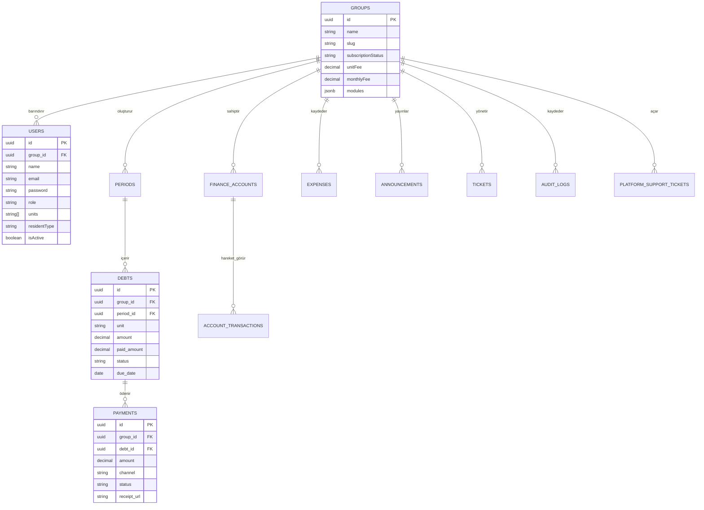

# 🏛️ Sitera — Akıllı Yaşam & Site Yönetim Platformu
## Kapsamlı A'dan Z'ye Master Mimari & Geliştirme Dokümantasyonu

> **Sürüm:** 2.4 (Production Ready)  
> **Tarih:** 11 Eylül 2026  
> **Hedef:** Canlıya Alma Öncesi Tam Sistem Özeti ve Test Rehberi  

---

## 1. Proje Özeti ve Vizyon

**Sitera**, siteler, apartmanlar, rezidanslar ve toplu konutlar için geliştirilmiş, kurumsal düzeyde **Çok Kiracılı (Multi-Tenant)**, **Row-Level Security (RLS)** korumalı ve modern kullanıcı deneyimine sahip yeni nesil bir site yönetim ve sakin yaşam platformudur.

Platform iki ana kullanıcı dünyasına hitap eder:
1. **Yönetim Dünyası (Admin & Süper Admin):** Finansal yönetim, aidat tahakkuku, gecikme faizi işletimi, masraf dağıtımı, kasa/banka hareketleri, arıza takibi, tebligat duyuruları ve platform destek yönetimi.
2. **Sakin Dünyası (Portal):** Borç sorgulama, kredi kartı/havale ile ödeme, dekont yükleme, arıza ve talep bildirme, bina duyurularını okuma ve yönetimle doğrudan iletişim kurma.

---

## 2. Mimari ve Teknoloji Yığını (Tech Stack)

Sitera, en yüksek performans, tip güvenliği ve modüler ölçeklenebilirlik için modern bir **Monorepo** yapısında inşa edilmiştir:

```
┌───────────────────────────────────────────────────────────────────────────────────┐
│                                SITERA MONOREPO                                    │
├───────────────────────┬───────────────────────────┬───────────────────────────────┤
│    APPS               │         PACKAGES          │         INFRASTRUCTURE        │
├───────────────────────┼───────────────────────────┼───────────────────────────────┤
│ • apps/web            │ • packages/shared         │ • PostgreSQL 16 (RLS Destekli)│
│   React 19 + Vite     │   Shared Types, DTOs,     │ • Redis 7 (Önbellek & Session)│
│   Glassmorphism UI    │   Validasyon & Sabitler   │ • Render Cloud (Canlı Dağıtım)│
│ • apps/api            │ • packages/tsconfig       │ • Turborepo Pipeline          │
│   NestJS 10 + TypeORM │   Ortak TypeScript        │ • Docker & Local Dev Env      │
│ • apps/mobile         │   Derleme Ayarları        │                               │
│   React Native (Expo) │                           │                               │
└───────────────────────┴───────────────────────────┴───────────────────────────────┘
```

| Katman | Teknoloji / Kütüphane | Konum | İşlevi |
| :--- | :--- | :--- | :--- |
| **Orkestrasyon** | Turborepo + npm Workspaces | Kök Dizin | Paralel derleme, bağımlılık optimizasyonu ve akıllı cache |
| **Backend API** | NestJS 10, TypeORM, RxJS | `apps/api` | Güvenli REST API, RLS Policy motoru, Audit logging, Rate-limiting |
| **Web Frontend** | React 19, Vite 6, TailwindCSS | `apps/web` | Kurumsal yönetim paneli + Sakin Portalı, SPA mimarisi |
| **Mobil Uygulama**| React Native 0.76, Expo 52 | `apps/mobile` | iOS ve Android platformları için mobil sakin deneyimi |
| **Veritabanı** | PostgreSQL 16 / 18 + RLS | `sitera-db` | Tablo seviyesinde Row-Level Security (`group_id` izolasyonu) |
| **Önbellek & Oturum** | Redis 7 + In-Memory Fallback | `redis` | Session yönetimi, 60sn tenant cache, otomatik bypass mekanizması |
| **Tip Paylaşımı** | `@sitera/shared` | `packages/shared`| Uçtan uca %100 senkron TypeScript arayüzleri ve iş kuralları |

---

## 3. Bugüne Kadar Gerçekleştirilen Geliştirmeler (A'dan Z'ye)

### 🔹 Faz 1: Temel Monorepo, Ortak Paketler ve Tip Güvenliği
- `apps/*` ve `packages/*` workspace yapısı kuruldu.
- Turborepo derleme boru hatları (`build`, `dev`, `lint`, `typecheck`) yapılandırıldı.
- `@sitera/shared` paketi oluşturuldu: Roller (`superadmin`, `admin`, `accountant`, `auditor`, `security`, `staff`, `member`), DTO'lar, API yanıt formatları (`ApiResponse<T>`) ve izin sistemi merkezi olarak modellendi.
- `@sitera/tsconfig` ile frontend, backend ve mobil için katı derleme kuralları paylaşıldı.

### 🔹 Faz 2: PostgreSQL Row-Level Security (RLS) & Multi-Tenancy
- **Çok Kiracılı Mimari:** Sitelerin verileri aynı veritabanında saklanır fakat veritabanı motoru düzeyinde PostgreSQL RLS ile tamamen izole edilir.
- `apps/api/src/database/database.module.ts`:
  - `ALTER TABLE "tablo_adi" ENABLE ROW LEVEL SECURITY;`
  - `ALTER TABLE "tablo_adi" FORCE ROW LEVEL SECURITY;`
  - `tenant_isolation_policy` oluşturularak her oturumda `app.current_group_id` değişkeni eşleşmeyen hiçbir veri satırının okunmasına veya yazılmasına izin verilmez.
- `TenantContext` (`AsyncLocalStorage`) ile Node.js thread-safe istek bazlı `group_id` yakalama altyapısı geliştirildi.
- Giriş (`/login`) ve genel kimlik doğrulama süreçlerinin aksamaması için `users` tablosu global erişimde tutulup uygulama seviyesinde `groupId` ve yetki filtreleriyle donatıldı.

### 🔹 Faz 3: Kimlik Doğrulama, Oturum & RBAC Yetkilendirme
- `AuthService` PBKDF2 kriptografik salt şifreleme algoritması ile donatıldı.
- Otomatik Süper Admin tohumlaması (`admin@sitera.com` / `Admin123!`) devreye alındı.
- 6 Farklı Rol Seviyesi modellendi:
  1. **Süper Admin (Platform):** Tüm siteleri görür, yeni site açar, lisans/modülleri yönetir, destek biletlerine müdahale eder.
  2. **Yönetici (Admin):** Kendi sitesinin tüm finansal, sakin, duyuru ve ayar işlemlerini yönetir.
  3. **Muhasebeci (Accountant):** Finans, tahsilat, kasa ve masraf işlemlerine tam yetkili, sakin portalı kısıtlı.
  4. **Denetçi (Auditor):** Finansal raporları, kasa hareketlerini ve audit logları salt-okunur denetler.
  5. **Güvenlik (Security):** Sakin teyidi, araç/plaka sorgulama, güvenlik duyurusu ve arıza bildirimi (finansa erişemez).
  6. **Sakin / Kat Maliki (Member):** Yalnızca kendi bağımsız bölümünün borçlarını, duyurularını ve taleplerini görür.

### 🔹 Faz 4: Site & Apartman Yönetimi (Multi-Tenant Management)
- **Site Kartları Grid & Liste Görünümü:** Sitelerin bağımsız bölüm sayıları, doluluk oranları, kasa bakiyeleri ve lisans durumları tek ekranda.
- **Site Detay Sayfası (`SiteDetailPage.tsx`):**
  - Yönetici atama, iletişim bilgileri, adres, blok ve bağımsız bölüm tanımları.
  - Deneme süresi (`trial`) ve ücretli abonelik (`paid`, `past_due`) takibi.
  - Bağımsız bölüm başına aidat birim fiyatı ve aylık ciro hesaplama motoru.
- **Pazaryeri & Akıllı Modül Kataloğu:**
  - *ANPR Otomatik Plaka Tanıma*
  - *Akıllı İnterkom & Görüntülü Arama*
  - *Tesis & Sosyal Alan Rezervasyonu*
  - *Ziyaretçi & Misafir QR Geçiş Kodu*
  - Modüllerin site bazında deneme veya satın alma ile anında açılıp kapatılabilmesi.

### 🔹 Faz 5: Finans, Aidat & Masraf Dağıtım Motoru
- **Dönem & Aidat Tahakkuku:** Aylık veya yıllık aidat dönemleri oluşturma (`PeriodEntity`).
- **Gecikme Zammı (KMK Uyumlu):** Günlük basit faiz veya aylık bileşik faiz ile geciken borçlara otomatik faiz işletimi.
- **Masraf Dağıtım Motoru (`AdminExpenseSplitView.tsx`):**
  - Fatura ve giderlerin 4 farklı metoda göre dairelere paylaştırılması:
    1. *Eşit Dağıtım (Flat)*
    2. *Arsa Payına Göre (Share)*
    3. *Metrekareye Göre (m²)*
    4. *Kişi Sayısına Göre*
- **Kasa & Banka Yönetimi (`FinanceAccountEntity`):**
  - Çoklu banka/kasa hesabı, IBAN tanımları, birincil hesap belirleme.
  - Gerçek zamanlı kasa bakiyesi, gelir/gider akışı ve transfer kayıtları.
- **Dekont & Havale Onay Masası:** Sakinlerin yüklediği dekontların yönetici tarafından incelenip tek tıkla onaylanması veya gerekçeli reddi (onay anında borç otomatik kapatılır).
- **Yazdırılabilir Resmi Makbuz Modalı:** Sakinler ve yöneticiler için resmi formatta, QR kodlu tahsilat makbuzu dökümü.

### 🔹 Faz 6: Duyuru, Tebligat & Okundu Takibi
- **Hedeflemeli Tebligat Sistemi (`AdminAnnouncementsView.tsx`):**
  - Tüm siteye genel duyuru
  - Belirli bloklara özel duyuru (örn: *"Yalnızca A Blok"* asansör bakımı)
  - Belirli dairelere özel bildirim
  - Malik / Kiracı ayrımına göre tebligat (örn: *"Yıllık Genel Kurul Çağrısı yalnızca ev sahiplerine"*)
- **Zamanlanmış Yayınlama (Scheduled Publishing):** İleri tarihli duyuru planlama.
- **Detaylı Okunma İstatistiği Modalı:** Hangi daire sakininin duyuruyu ne zaman açıp okuduğunun saat ve dakika bazında dökümü.

### 🔹 Faz 7: Talep, Arıza & Bakım Yönetimi
- **Sakin Arıza Bildirimi:** Fotoğraf yükleme, aciliyet seviyesi (`düşük`, `normal`, `acil`), konum ve kategori seçimi.
- **Yönetici Çözüm Masası (`AdminTicketsView.tsx`):**
  - Durum güncellemeleri (`Açık`, `İşlemde`, `Çözüldü`, `İptal`).
  - Çözüm notu ekleme (sakin portalına anında yansır).
  - Diferansiyel aralıklarla performanslı arka plan güncellemesi.

### 🔹 Faz 8: Bildirim Merkezi & Çok Kanallı İletişim
- **TopBar Bildirim Çekmecesi (`NotificationCenterPopover.tsx`):**
  - Okunmamış sayaç rozeti, tek tıkla tümünü okundu işaretleme.
  - Sesli bildirim ve tarayıcı uyarısı desteği.
- **SMS & WhatsApp Şablon Entegrasyonu:**
  - Borç hatırlatma, şifre sıfırlama ve acil durum SMS/WhatsApp metinlerini tek tıkla panoya kopyalama veya gönderme.

### 🔹 Faz 9: Denetim (Audit) Log & Güvenlik Takibi
- **Değiştirilemez Günlük Kaydı (`audit_logs`):**
  - Giriş-çıkış hareketleri (`AUTH_LOGIN_SUCCESS`, `AUTH_LOGIN_FAILED`).
  - Finansal onaylar (`FINANCE_PAYMENT_APPROVED`, `EXPENSE_CREATED`).
  - Kullanıcı yetki değişiklikleri ve RLS müdahale kayıtları.
  - İstemci IP adresi, User-Agent ve işlem zaman damgası saklama.
  - Rol, seviye ve kategori bazında filtrelenebilir denetçi arayüzü.

### 🔹 Faz 10: Platform Destek & Canlı Müdahale Modu (Impersonation)
- Site yöneticisinin karşılaştığı bir sorunda KVKK onayı (`allowSiteAccess: true`) vererek platform Süper Admin'inden canlı destek talep etmesi (`platform_support_tickets`).
- **Süper Admin Canlı Müdahale Modu:**
  - Süper Admin, yöneticinin ekranına güvenli geçici yetkiyle girer (`impersonate`).
  - Üst barda kırmızı renkte **"Canlı Destek / Müdahale Modu Aktif"** uyarısı çıkar.
  - İşlem bitince tek tıkla Süper Admin paneline güvenle geri dönülür (`exit impersonation`).

### 🔹 Faz 11: Sözleşme & KVKK Yönetimi
- `legal_documents` tablosu ve yönetici paneli:
  - *Kullanıcı Sözleşmesi (Terms of Service)*
  - *KVKK Aydınlatma Metni (Privacy & GDPR)*
- Süper Admin arayüzünden doğrudan düzenlenebilir, versiyonlanır ve canlıya anında yansır.
- Varsayılana sıfırlama (*Reset to Default*) yeteneği.

### 🔹 Faz 12: Production Cloud Deployment (Render.com) & Optimizasyonlar
- **Render PostgreSQL (`sitera-db`):** Cloud SSL bağlantısı (`rejectUnauthorized: false`) ile bağlandı.
- **Render Web Service (`sitera-api`):**
  - `DATABASE_URL` desteği, `0.0.0.0` port bağlama, monorepo build komutları (`packages/shared` -> `apps/api`) sağlandı.
  - Derleme bağımlılıkları (`@nestjs/cli`, `typescript`) üretim paketlerine entegre edildi.
  - Canlı ortamda demo/dummy duyuruları temizleyen ve gerçek veriye alan açan temizleyici eklendi.
- **Render Static Site (`sitera-web`):**
  - Vite SPA Rewrite kuralı (`/* -> /index.html`) ile sayfa yenilemelerinde (`F5`) 404 sorunu çözüldü.
  - `VITE_API_URL` dinamik environment değişkenine bağlandı.
  - **Responsive Giriş Ekranı:** Mobilde ağır görsel desenler gizlenerek (`hidden lg:flex`) sadece odaklanmış temiz formun açılması sağlandı.

---

## 4. Veritabanı Varlık (Entity) Şeması


   
---

## 5. Canlı Ortam Erişim Bilgileri

| Servis | Bağlantı URL'i | Barındırma | Durum |
| :--- | :--- | :--- | :--- |
| **Frontend (Web Panel)** | [sitera-web.onrender.com](https://sitera-web.onrender.com) | Render Static Site | 🟢 CANLI |
| **Backend (REST API)** | [sitera-api.onrender.com/api](https://sitera-api.onrender.com/api) | Render Web Service | 🟢 CANLI |
| **PostgreSQL Veritabanı** | `sitera-db` (Frankfurt EU-Central) | Render PostgreSQL | 🟢 CANLI |

### Varsayılan Giriş Bilgileri:
- **Rol:** Platform Süper Yöneticisi
- **E-Posta:** `admin@sitera.com`
- **Şifre:** `Admin123!`

---

## 6. Production Test & Doğrulama Kontrol Listesi (Checklist)

Sistemi bir müşteri veya site yöneticisi gözüyle baştan sona test etmek için aşağıdaki adımları sırayla uygulayabilirsiniz:

### 🧪 Test 1: Süper Admin & Site Kurulum Akışı
- [ ] `https://sitera-web.onrender.com/login` adresine gidin.
- [ ] `admin@sitera.com` / `Admin123!` ile giriş yapın.
- [ ] Masaüstü ve mobil ekran boyutlarında giriş ekranının kusursuz açıldığını teyit edin.
- [ ] **Tenant & Siteler** menüsüne gidin -> **"Yeni Site Ekle"** butonuna basın.
- [ ] Örnek bir site açın (Örn: `Çınar Konutları`, 30 Daire, Birim Aidat: 750 ₺).
- [ ] Yeni sitenin kartının listeye düştüğünü ve detayına girilebildiğini doğrulayın.

### 🧪 Test 2: Kullanıcı Tanımlama & Roller
- [ ] **Kullanıcı Yönetimi** sayfasına gidin.
- [ ] Açtığınız siteye bir **Yönetici (Admin)** ve 2 adet **Sakin (Member)** ekleyin:
  - *Yönetici:* `yonetim@cinar.com` / `Sifre123!`
  - *Sakin 1:* `ahmet@cinar.com` (Daire 1)
  - *Sakin 2:* `ayse@cinar.com` (Daire 2)
- [ ] Süper Admin oturumunu kapatıp oluşturduğunuz site yöneticisi ile giriş yapın.

### 🧪 Test 3: Finans, Aidat ve Kasa İşlemleri
- [ ] **Finans & Aidat** sayfasına gidin.
- [ ] **Yeni Dönem Başlat** diyerek bu ay için aidat tahakkuk ettirin (Daire başına otomatik 750 ₺ borç oluşmalı).
- [ ] Kasa/Banka hesapları sekmesinden sitenin Ziraat veya İş Bankası IBAN hesabını tanımlayın.
- [ ] **Gider Ekle / Masraf Paylaştır** ekranından ortak bir fatura masrafı (Örn: 3.000 ₺ Bahçe Bakımı) girip eşit paylaştırın.

### 🧪 Test 4: Sakin Portalı & Ödeme Süreci
- [ ] Çıkış yapıp `ahmet@cinar.com` (Sakin 1) hesabı ile giriş yapın.
- [ ] Sakin ana sayfasında Daire 1'e ait aidat borcunun listelendiğini görün.
- [ ] **Ödemelerim** sayfasına geçip havale bildirimi yapın veya dekont yükleyin.
- [ ] Tekrar yönetici hesabına geçip **Ödeme Onay Kuyruğu**ndan bu dekontu onaylayın.
- [ ] Borcun kapandığını ve resmi makbuzun üretildiğini doğrulayın.

### 🧪 Test 5: Duyuru & Arıza Bildirimi
- [ ] Yönetici panelinden yeni bir duyuru yayınlayın (*"Asansör Bakımı Hakkında"*).
- [ ] Sakin hesabıyla giriş yapıp sağ üst bildirim çanında kırmızı rozet çıktığını ve duyurunun okundu olarak işaretlenebildiğini test edin.
- [ ] Sakin hesabından **Talep & Arıza** menüsünden yeni bir bildirim açın (*"Sensörlü Lamba Yanmıyor"*).
- [ ] Yönetici panelinde bu arızayı görüp *"Çözüm Notu"* ekleyerek kapatın.

### 🧪 Test 6: Güvenlik, SPA Yenileme & Audit Log
- [ ] Sitedeyken herhangi bir iç sayfada (örn: `/admin/announcements`) **F5 (Sayfayı Yenile)** yapın; sayfanın 404 vermeden doğrudan açıldığını doğrulayın.
- [ ] **Audit Log** sayfasına giderek yaptığınız tüm işlemlerin IP ve zaman damgasıyla kaydedildiğini denetleyin.
